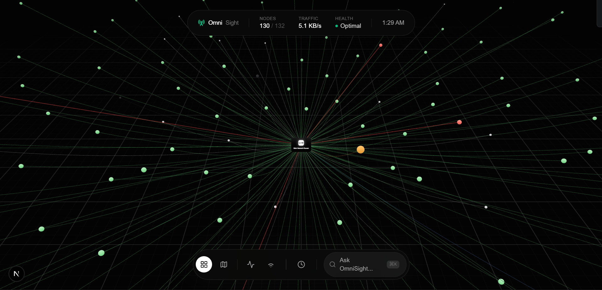
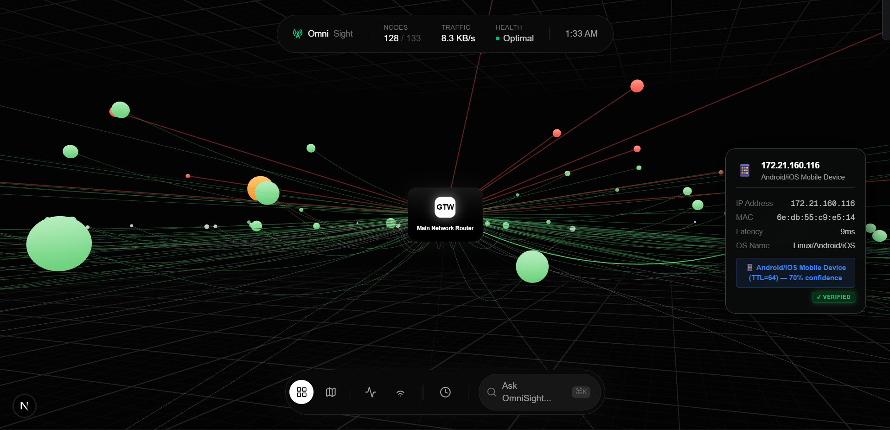
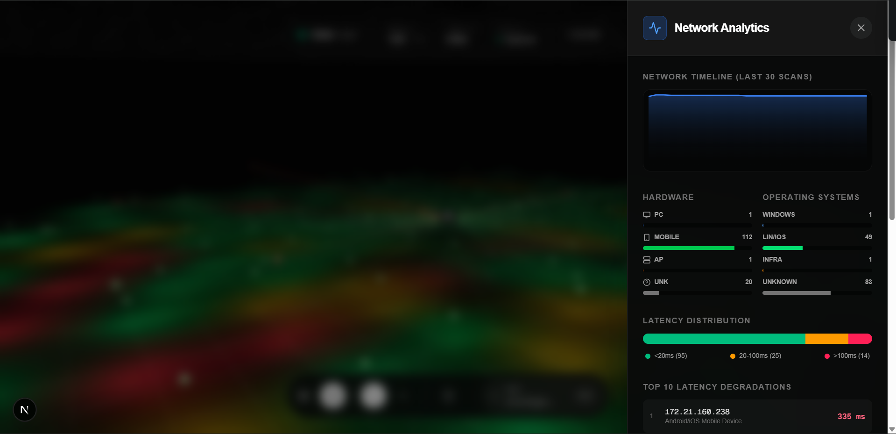
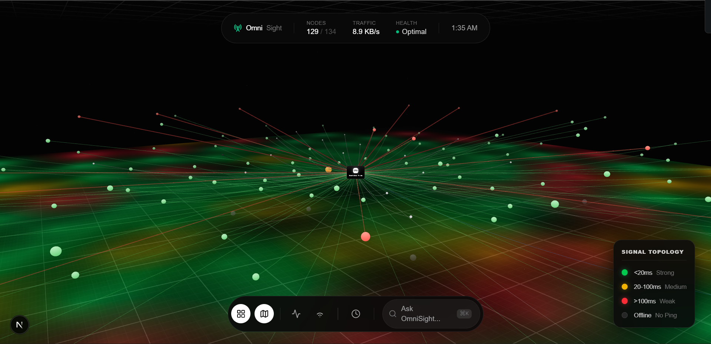

<div align="center">
  
  
  <h1>OmniSight Network Visualizer</h1>
  <p><strong>Self-Hosted 3D Network Telemetry & AI Anomaly Detection System</strong></p>

  <p>
    <a href="https://github.com/AmanDevNet/Omnisight/commits"></a>
    <a href="https://fastapi.tiangolo.com/"></a>
    <a href="https://nextjs.org/"></a>
    <a href="https://docs.pmnd.rs/react-three-fiber"></a>
  </p>
</div>

---

## 📖 What is OmniSight?

**OmniSight** is an advanced, self-hosted network monitoring platform that transforms invisible network traffic into an interactive, real-time 3D visualization. 

Instead of reading through endless lists of IP addresses and static tabular logs, OmniSight provides administrators with a dynamic "spatial map" of their network. Built intentionally with a decoupled **Client-Server architecture**, OmniSight utilizes a lightweight packet-sniffing "Agent" to map the local network and securely stream the telemetry over WebSockets to a dedicated API Backend.

From there, it actively profiles connected devices, monitors bandwidth consumption, and utilizes Machine Learning to alert users the second an unrecognized or anomalous device breaches the network perimeter. The entire ecosystem can be run entirely on a single machine or deployed across private servers.

---

## 🏗️ Technical Architecture

OmniSight operates using a distributed design pattern, cleanly separated into three modular systems:

1. **The Edge Agent (`/agent_run.py`)**
   A highly concurrent Python scanner that sits on the local network. It performs low-level packet sniffing (Scapy), ARP sweeps, ICMP pings, and mDNS/SSDP service discovery to map active devices. It streams this telemetry to the backend API.
   
2. **The API Backend (`/backend`)**
   A multi-tenant **FastAPI** server that acts as the platform's brain. 
   - Uses **WebSockets** to handle thousands of live data points per second.
   - Utilizes a **Scikit-Learn Random Forest** pipeline to dynamically classify devices based on OUI boundaries, latency variance, and TTL signatures.
   - Encompasses a **Retrieval-Augmented Generation (RAG)** pipeline utilizing **Google Gemini 2.0 Flash** over a **ChromaDB** vector store, enabling users to ask historical network questions in natural language.
   - Uses **SQLite** for persistent, tenant-isolated data storage and simulated authentication (JWT/API Keys).

3. **The User Interface (`/frontend`)**
   A **Next.js** web application providing a premium, glassmorphic UX. 
   - Renders devices natively in the GPU via **React Three Fiber** and WebGL.
   - **Zustand** is used to hydrate the frontend store with WebSocket streams, drastically minimizing latency between real-world network events and the UI dashboard.

---

## ✨ Features

* **Live 3D Network Topology**: Watch devices interact in three-dimensional space with real-time ping tracking and bandwidth visualizers.
* **Threat Detection ML**: Immediately flags spoofed MAC addresses or unrecognized device signatures using custom Scikit-Learn pipelines.
* **OmniChat (AI Analyst)**: Ask questions like *"Did any unknown devices connect last night?"* and receive mathematically accurate answers derived from vector-embedded network logs.
* **Network DVR Time Machine**: Scrub backward in time to see exactly what your network looked like during past outages or latency spikes.
* **Locally Isolated / Zero Cloud Dependency**: Operates powerfully on a local machine to ensure network scan data never has to leave your premises.

---

## 📸 Interface Showcases

| **Machine Learning Device Profiling** | **Live Network Analytics** |
|:---:|:---:|
|  |  |
| *Native OS Fingerprinting, Confidence Scoring, and ML Threat Flags.* | *Hardware splits, Latency distributions, and degraded nodes over time.* |

<div align="center">
  
  <p><em><strong>Signal Topology View:</strong> 3D Heatmapping of local network congestion.</em></p>
</div>

---

## 🚀 Quick Start Guide

To run OmniSight on your local machine, you will need to start the three core modules simultaneously.

### 1. Start the FastAPI API Server
```bash
# Clone the repository
git clone https://github.com/AmanDevNet/Omnisight.git
cd Omnisight

# Set up Python environment & dependencies
python -m venv venv
venv\Scripts\activate
pip install -r requirements.txt

# Run the backend
python -m uvicorn backend.main:app --host 0.0.0.0 --port 8000 --reload
```

### 2. Start the Next.js Frontend
```bash
# Open a new terminal
cd frontend

# Install Node dependencies
npm install

# Run the development server
npm run dev
```
> **Visit `http://localhost:3000`** in your browser, click "Sign Up", create a local account, and copy the provided API Key.

### 3. Run the Local Scanner Agent
```bash
# Open a third terminal in the project root
set OMNISIGHT_API_KEY="YOUR_API_KEY_HERE"

# Start the packet sniffer
python agent_run.py
```
> Go back to your browser dashboard. You will instantly see your local network nodes populate the 3D space!

---

## 🔑 Environment Variables
You will need the following `.env` configuration to use the AI engine capabilities:

```ini
# Backend (.env) located in standard project root
GEMINI_API_KEY=your_gemini_api_key_here
```

---

## 📬 Contact & Creator

**Aman Sharma**  
*Full Stack Software Engineer & Systems Developer*

- 🔗 **LinkedIn:** [Aman Sharma](https://www.linkedin.com/in/AmanDevNet)
- 🐙 **GitHub:** [@AmanDevNet](https://github.com/AmanDevNet)
- ✉️ **Email:** theamansharma.27@gmail.com

> *OmniSight was built to demonstrate proficiency in handling highly concurrent WebSocket networking, local hardware telemetry, Machine Learning pipelines, and modern React Three Fiber graphics capabilities.*
